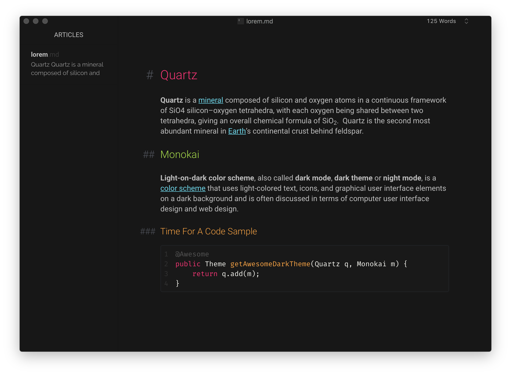

# Quartz Theme for Typora

This is a fork of the minimalistic [Quartz](https://github.com/troennes/quartz-theme-typora) theme for typora. It contains a dark theme, **Quartz Mono** which is a colorful theme inspired by the Monokai color scheme. It also contains a light theme, **Quartz Mini** which is slightly modified from the original solely based on personal preference.

Tested on a MacOS.

## How to install

1. Download or Clone this repo.
2. Go to Typora Preferences, select "Open Theme Folder".
3. Copy everything form the "theme" folder into the newly opened folder.
4. Restart Typora, then select it from Themes menu.
